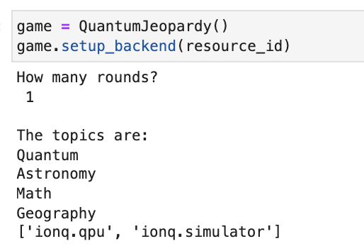
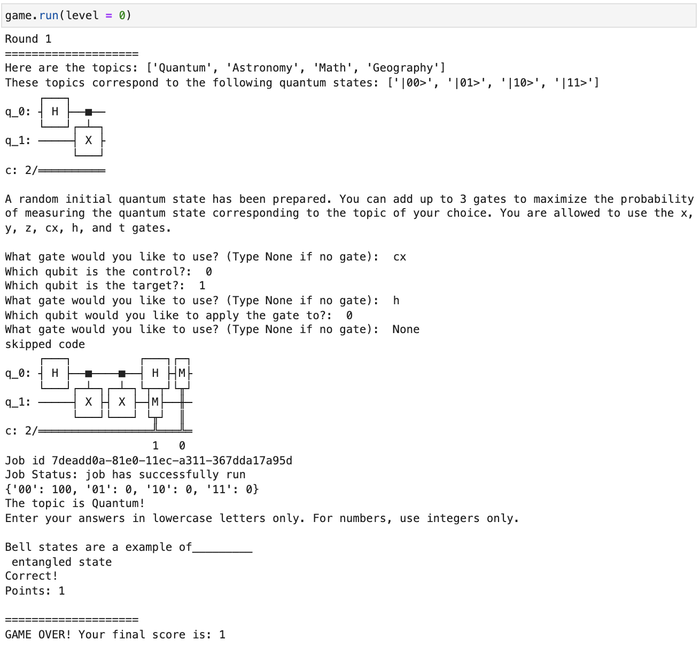
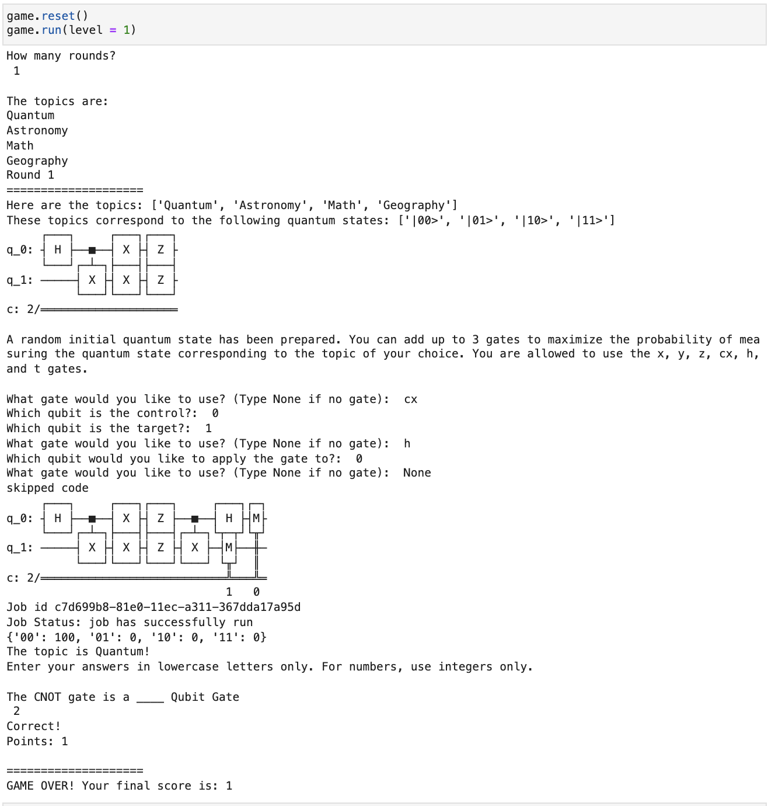
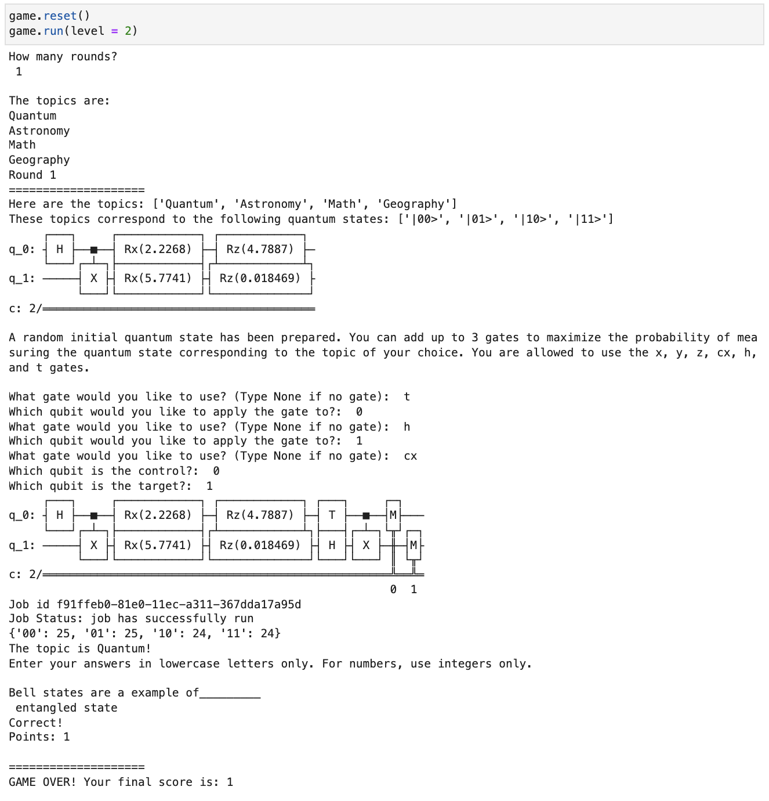

# QUANTUM JEOPARDY
Employ Quantum states to increase your chances to WIN!

## TEAM
Shwetlana Jha, Skai Nzeuton, Abha Naik

## DATE
30 Jan 2022

## ABSTRACT
We can hear people cheering aloud as the high school quiz team contest for a national level trophy. As a member of the team you wish to win as many points as possible. After the cut-throat rounds with rivals here comes the round where your quantum computing knowledge comes to your aid. In this round you are given 4 topics, in which one topic is the field of your expertise. As such, you really want your team to get this topic. However, unlike a Classical Quiz, the possibility of getting the topic is not completely random. These topics are in a superposition in a 2 qubit system. Each topic represent a possible outcome of measuring the superposition, where the outcome is the topic for your team. You are super excited as you are told that by applying some gates you will be able to manipulate the initial quantum state of the system so as to maximise the probability of finding your target topic. This initial quantum state can get increasingly complex as you increase the level, making the game more difficult. 

## HOW TO PLAY
1. Participants begin with choosing the number of rounds.(In the case of a Quiz this number would be decided by the organisers)
2. The list of topics will be displayed with the corresponding state.
3. The initial state of the circuit will be displayed. It will be an arbitary state depending on the level and participants can use upto 3 gates to manipulate this initial state in order to maximise the probability of finding their desired topic.
4. The state of the modified circuit will be displayed and measurement executed on either a simulator or hardware.
5. Once the job is executed you will get your topic! (This is the time to rejoice if you had applied the right gates as you get the topic of your expertise. However, if you failed to apply the right gates...Good Luck with the other topic. You can also be clever and create a superposition between 2 topics : one of your expertise and another of your second preferance.)
6. Once you get a topic you will have to answer a question that will be randomly selected related to the topic.
7. A correct answer will add a point to your team's scoreboard and a wrong one will result in a negative marking.
8. The game will loop depending on the number of rounds.
9. At the end, your total score will be displayed. 

## HOW HIGH IS THE PROBABILITY OF FINDING QUANTUMNESS IN THIS GAME?
While a classical quiz game is absolutely random or definite (in the case that the players can manually select a topic), adding the properties of quantum gate operations not only adds a superposition of predictability and randomness to the game. These quantum properties make the players develop a need to learn about gate operations and probability amplitude, in order to best manipulate their chances at winning. It also stimulates curiosity in the minds of the viewers about this wierd thing called "superposition." Here the topic is in a complex superposition of all topics until selected.

## IMPLEMENTATION
We created a `QuantumJeopardy` class, which can be used to run the game described above. Below, we have pasted some example runs.

#### Setup

#### Level 0

#### Level 1

#### Level 2

## Acknowledgments

Thank you to Parmeet for answering our questions, and thanks to the MIT iQuHACK team for organizing such a wonderful event!
